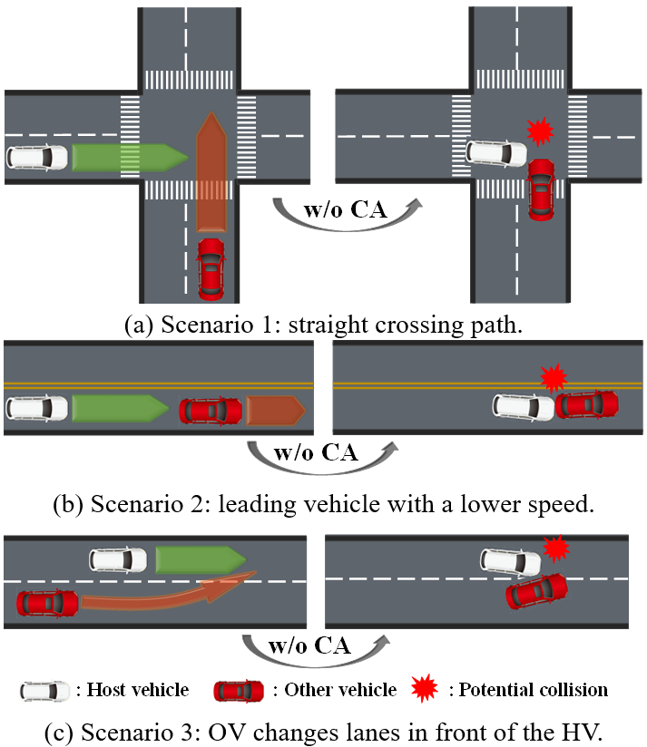

# Collision avoidance strategy for AVs with differnet consumer preference
Vehicle was a fundamental tool of transportation. However, according to the NHTSA report, there were 52,645 fatal crashes and more than 3 million injury crashes involving to the vehicles, most of which were caused by the driver mistakes due to the complex traffic environment. Thus, an advanced safeguarding decision-making system for vehicle to replace the human decisions at the dangerous situation (e.g. potential collision) to avoid the crash is necessary. Besides, with the improvement of passenger demand for vehicle driving quality, we should pay more attention to the passenger comfort. Therefore, a more robustly comprehensive vehicle safety system should be proposed to meet the demand for passenger (or driver) with different preference (e.g. aggressive or conservative).

## Approach
To solve the problems mentioned above, we proposed a situation assessment based collision avoidance decision-making framework, which was adaptive to multi-scenario to help the reduction of traffic accidents. Firstly, a probabilistic-model based situation assessment module using conditional random field (CRF), which considered both safety metrics and evasive ability for collision, was proposed to assess the risk of surrounding vehicles. Then, a collision avoidance strategy with different consumer preference was proposed to meet different consumer demand for driving comfort. Finally, we validated our algorithm in a simulator, called Carla.

## Experiments
three crash scenarios respectively called Straight crossing path (SCP), leading vehicle at lower speed (LVLS) and immediate lane change maneuver (ILCM) were introduced here to validate the proposed strategy, see following figture:

## Results with aggressive preference
The experiment recorded some kinematics and risk assessment results of host-vehicle, which were shown following:

The corresponding animation was shown following:

